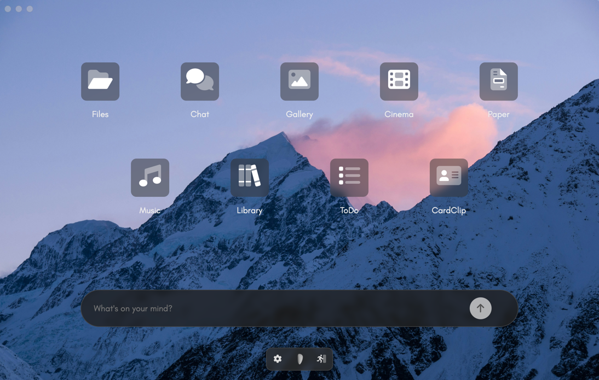

# persys-desktop



Persys desktop application. Electron based application to access your Persys server.

Refer to the [main](https://github.com/persys-ai/persys) repo for contributions and other instructions.

Current published version: 2.1.0
Current dev version: 3.0.0

---

## Download
If you'd like to download the signed package, click [here for the Mac app](https://persys.s3.us-east-1.amazonaws.com/persys-client/updates/darwin/arm64/Persys_Installer.dmg) or copy and paste the link below into your browser.
```
https://persys.s3.us-east-1.amazonaws.com/persys-client/updates/darwin/arm64/Persys_Installer.dmg
```

---

## Installation
If you'd rather pull the codebase to run in development mode, please follow the instructions below:

1. Pull repo
```bash
git clone https://github.com/persys-ai/persys-desktop
```

2. Navigate to folder
```bash
cd persys-desktop
```

3. Install dependencies
```bash
npm install
```

4. Run it!
```bash
npm start
```

---

## Login
If you have already setup [persys-server](https://github.com/persys-ai/persys-server),
all you need to do is specify your address on the login page and use the password you created.
Do not use "http" or "https" in the server address on login.
If you're running the server on the same machine as the desktop app, simply put the hostname of your machine.
To find your hostname, run `hostname` or `echo $HOST` on your persys-server instance. This will ensure all `persys-server` services reach each other. 
The different ports for the services will use that base address.
If you're not getting a response, you can also add `.local` to the end of the hostname.

`assets/`
You'll find all assets here. Scripts, styles and images.

`assets/scripts/`
All JavaScript code.

`assets/styles/`
All CSS styling.

`assets/images/`
Image assets.

`src`
All pages including `index.js` and `preload.js` here.
Minified scripts and styles are located under `src/src`.
Each "app" has its own index html page for simplicity's sake.

---

## Development
If you're making changes to `assets/scripts` or `assets/styles`, you need to run the minifier/compress script.
The minifier is located under `config/compress.php`. It is a PHP file that takes all JS scripts and styles and spits out to `src/src/interface.min.js` and `src/src/style.min.css` respectively.

Running the minifier/compress script:
```bash
php config/compress.php
```

Minifier provided by `MatthiasMullie`. License under `config/minify`.

You can alternatively include all the scripts and styles directly to the html pages to view instant changes during development.